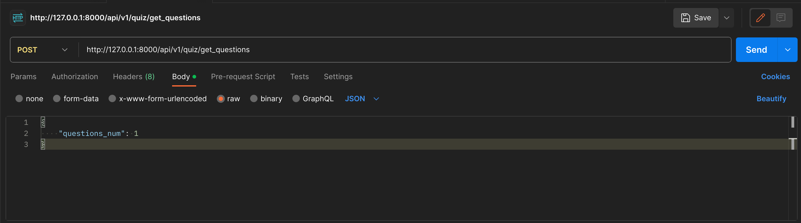
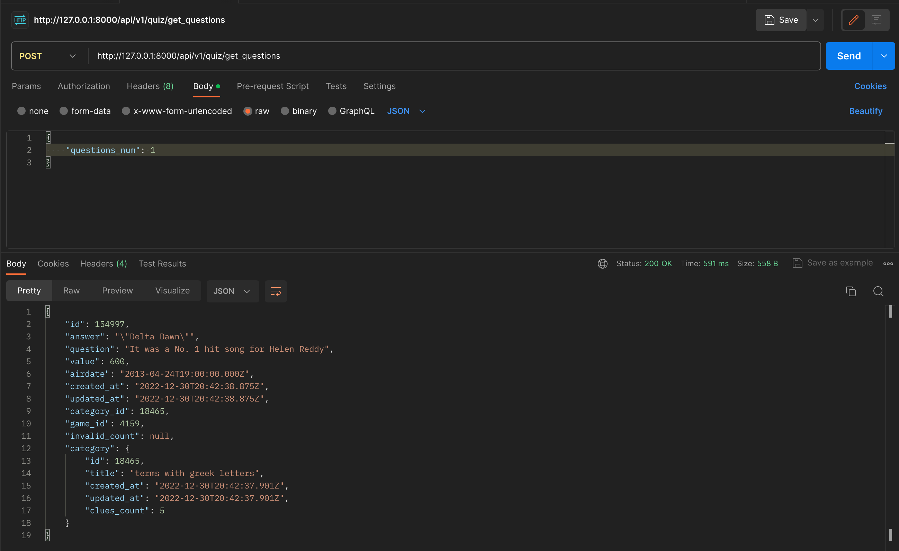

# Quiz-API

## There is an API that gets quiz questions from another API and saves them into database.

### Execution guide:
	1. Run `git clone https://github.com/badjokeresult/Quiz-API.git`
	2. `cd Quiz-API`
	3. `docker-compose up -d` (should be executed with root-privileges)
	4. Run `psql -h localhost -p 5432 -U quizuser`
	5. Enter the password provided in `docker-compose.yaml`
	6. When getting into psql console, run `\i init.sql`
	7. On this step everything is up-to-date

### Usage guide:
	This API provides only one POST-method.
	Send a POST-method `http://127.0.0.1:8000/api/v1/quiz/get_questions` with JSON-body `{questions_num: <int_value>}`. As a result you will see the last saved question text.

### Example:
1. Let's create a POST-request with the JSON-body through a Postman.

2. Send it.
3. As a result, we get a text of a question.

